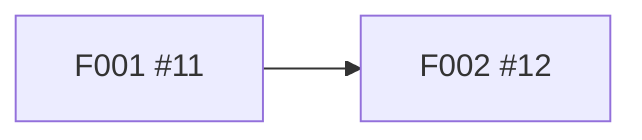

<!-- pi-scaffold:v1:start -->
## 目的
利用者が一覧をCSVで保存できるようにする。

## 背景・元の要望
### 元の要望
一覧をCSVでダウンロードできるようにしたい。<br>
文字コードはUTF-8がよい。

### 背景
月次集計で毎回手作業で転記している。

### 参照資料
- https://example.com/requests/42

## 実現したいこと
- REQ001：顧客一覧をCSVで保存できる
- REQ002：注文一覧をCSVで保存できる

## 完了条件
| ID | 対応する要件 | 検証方法 | 合格基準 |
|---|---|---|---|
| AC001 | REQ001 | E2Eテストでダウンロードを実行 | 表示中の行と同じ件数のCSVが保存される |
| AC002 | REQ001, REQ002 | 文字化け確認 \| Excelで開く | 日本語が&lt;正しく&gt;表示される |

## 対象外
なし（確認済み）

## 制約
- 既存APIの応答形式は変えない

## 未決事項
| ID | 確認事項 | 回答 | 根拠 |
|---|---|---|---|
| Q001 | 【必須】対象の一覧は顧客一覧だけか | 顧客一覧と注文一覧の2つ | https://example.com/meetings/2026-10-01 |
| Q002 | 【必須】【矛盾】区切り文字はカンマかタブか（依頼書と口頭説明が食い違う） | 未回答 | — |

## 調査項目
| ID | 調査内容・完了条件 | 状態 | 結論・根拠・限界 |
|---|---|---|---|
| R001 | 10万行の出力に何秒かかるか<br>必要な根拠：計測ログ<br>完了条件：p95の秒数が分かる | 解決済み | 結論：p95で4.2秒<br>根拠：https://example.com/bench/1<br>限界：開発機での計測 |
| R002 | 既存の出力ライブラリが使えるか<br>必要な根拠：ライセンスと保守状況<br>完了条件：採否を判断できる | 未着手 | 未確定：使えそうだが保守が止まっている<br>根拠：—<br>限界：最新版未確認 |
| R003 | ストリーミング出力に対応できるか<br>必要な根拠：試作コード<br>完了条件：1GBで落ちない | 調査中 | — |

## 決定事項
| ID | 論点 | 決定 | 理由・根拠 |
|---|---|---|---|
| D001 | 文字コード | UTF-8（BOM付き） | Excelでの文字化けを避ける<br>根拠：https://example.com/meetings/2026-10-01 |

## 設計・実装への参照
### 基本設計
- パス：docs/design/export.md
- SHA-256：aaaaaaaaaaaaaaaaaaaaaaaaaaaaaaaaaaaaaaaaaaaaaaaaaaaaaaaaaaaaaaaa
- Git ref：cccccccccccccccccccccccccccccccccccccccc

### 依存関係


- #11 → #12：UIはAPIを使う

### Wave計画（基本設計時に記入）
- Wave 1：#11
- Wave 2：#12

<details>
<summary>Scaffold管理データ（自動管理）</summary>

```json
{
  "version": 1,
  "kind": "epic",
  "workflowId": "11111111-1111-4111-8111-111111111111",
  "revision": 7,
  "createOperationId": "22222222-2222-4222-8222-222222222222",
  "stage": "basic-design",
  "purpose": "利用者が一覧をCSVで保存できるようにする。",
  "originalRequest": {
    "text": "一覧をCSVでダウンロードできるようにしたい。\n文字コードはUTF-8がよい。",
    "sourceRefs": [
      "https://example.com/requests/42"
    ]
  },
  "background": "月次集計で毎回手作業で転記している。",
  "questions": [
    {
      "questionId": "Q001",
      "kind": "question",
      "question": "対象の一覧は顧客一覧だけか",
      "answer": "顧客一覧と注文一覧の2つ",
      "required": true,
      "sourceRef": "https://example.com/meetings/2026-10-01"
    },
    {
      "questionId": "Q002",
      "kind": "conflict",
      "question": "区切り文字はカンマかタブか（依頼書と口頭説明が食い違う）",
      "answer": null,
      "required": true,
      "sourceRef": null
    }
  ],
  "requirements": [
    {
      "id": "REQ001",
      "description": "顧客一覧をCSVで保存できる"
    },
    {
      "id": "REQ002",
      "description": "注文一覧をCSVで保存できる"
    }
  ],
  "criteria": [
    {
      "id": "AC001",
      "requirementIds": [
        "REQ001"
      ],
      "verification": "E2Eテストでダウンロードを実行",
      "expectedResult": "表示中の行と同じ件数のCSVが保存される"
    },
    {
      "id": "AC002",
      "requirementIds": [
        "REQ001",
        "REQ002"
      ],
      "verification": "文字化け確認 | Excelで開く",
      "expectedResult": "日本語が\u003c正しく\u003e表示される"
    }
  ],
  "constraints": [
    "既存APIの応答形式は変えない"
  ],
  "outOfScope": [],
  "research": [
    {
      "researchId": "R001",
      "question": "10万行の出力に何秒かかるか",
      "requiredEvidence": "計測ログ",
      "doneCondition": "p95の秒数が分かる",
      "state": "resolved",
      "claim": null,
      "conclusion": "p95で4.2秒",
      "evidenceRefs": [
        "https://example.com/bench/1"
      ],
      "limitations": [
        "開発機での計測"
      ]
    },
    {
      "researchId": "R002",
      "question": "既存の出力ライブラリが使えるか",
      "requiredEvidence": "ライセンスと保守状況",
      "doneCondition": "採否を判断できる",
      "state": "pending",
      "claim": null,
      "conclusion": "使えそうだが保守が止まっている",
      "evidenceRefs": [],
      "limitations": [
        "最新版未確認"
      ]
    },
    {
      "researchId": "R003",
      "question": "ストリーミング出力に対応できるか",
      "requiredEvidence": "試作コード",
      "doneCondition": "1GBで落ちない",
      "state": "in_progress",
      "claim": {
        "researchId": "R003",
        "operationId": "33333333-3333-4333-8333-333333333333",
        "sessionId": "session-example",
        "specBaseDigest": "aaaaaaaaaaaaaaaaaaaaaaaaaaaaaaaaaaaaaaaaaaaaaaaaaaaaaaaaaaaaaaaa"
      },
      "conclusion": null,
      "evidenceRefs": [],
      "limitations": []
    }
  ],
  "decisions": [
    {
      "id": "D001",
      "topic": "文字コード",
      "decision": "UTF-8（BOM付き）",
      "reason": "Excelでの文字化けを避ける",
      "sourceRefs": [
        "https://example.com/meetings/2026-10-01"
      ]
    }
  ],
  "design": {
    "path": "docs/design/export.md",
    "sha256": "aaaaaaaaaaaaaaaaaaaaaaaaaaaaaaaaaaaaaaaaaaaaaaaaaaaaaaaaaaaaaaaa",
    "gitRef": "cccccccccccccccccccccccccccccccccccccccc"
  },
  "dependencyPlan": {
    "version": 1,
    "nodes": [
      {
        "featureKey": "F001",
        "issue": 11,
        "contracts": [
          "CSV書き出しAPI"
        ],
        "startConditions": [],
        "editScope": [
          "src/export/"
        ]
      },
      {
        "featureKey": "F002",
        "issue": 12,
        "contracts": [],
        "startConditions": [
          "F001のAPIが固まっている"
        ],
        "editScope": [
          "src/ui/"
        ]
      }
    ],
    "edges": [
      {
        "from": 11,
        "to": 12,
        "reason": "UIはAPIを使う"
      }
    ]
  },
  "wavePlan": {
    "version": 1,
    "assignments": [
      {
        "issue": 11,
        "wave": 1
      },
      {
        "issue": 12,
        "wave": 2
      }
    ],
    "dependencyDigest": "bbbbbbbbbbbbbbbbbbbbbbbbbbbbbbbbbbbbbbbbbbbbbbbbbbbbbbbbbbbbbbbb",
    "featureSetDigest": "aaaaaaaaaaaaaaaaaaaaaaaaaaaaaaaaaaaaaaaaaaaaaaaaaaaaaaaaaaaaaaaa"
  },
  "handoff": null
}
```
</details>
<!-- pi-scaffold:v1:end -->
